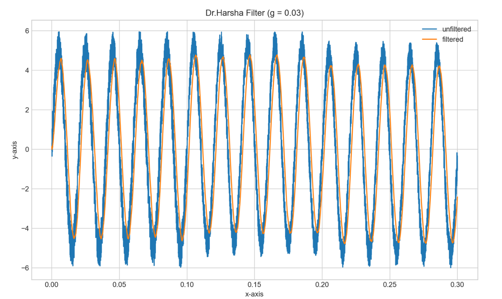

## Software Based Data Prepoccessing (Filter)

This repository is dedicated to the first assignment of the Automation and Control Techlnologies Module (EE4013). Assignment is to implement a Moving average filter and s/s+g filter (Dr.Harsha Filter) and perform the filter on the noise contaminated signal file.

#### Results

##### Moving Average Filter

##### Dr. Harsha Filter

